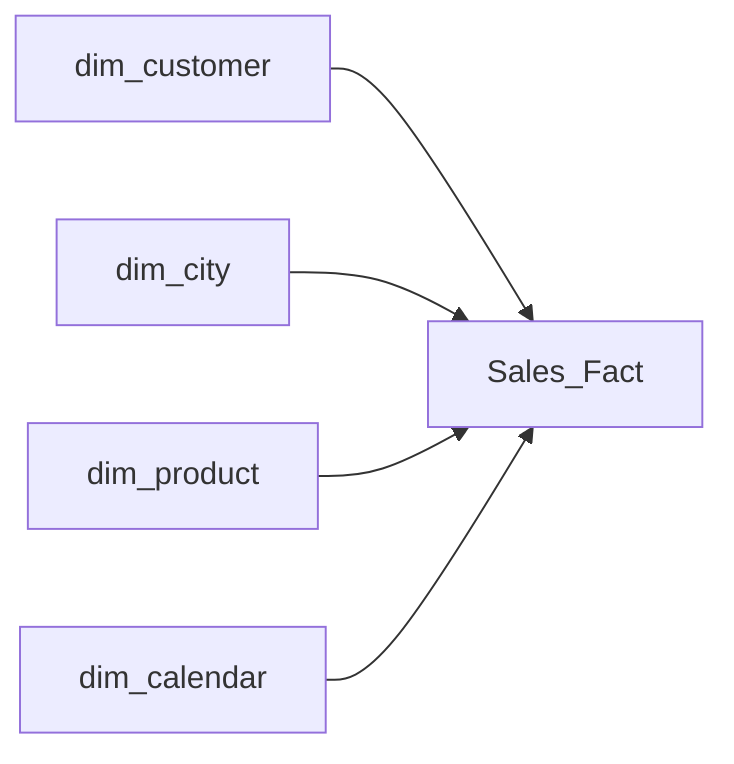

# 🛒 Freshmart Superstores Sales Performance Report

## 📊 Project Overview

This project analyzes **Freshmart Superstores’** performance across three branches — **Mandalay, Naypyitaw, and Yangon** — between **January and March 2019**.

The main goal is to uncover insights into:

* Sales and profitability across branches
* Customer demographics and buying behavior
* Product performance and payment preferences
* Daily and monthly sales trends

---

🧠 <b>Table of Contents</b>

- [Project Context](#-project-context)
- [Key Questions](#-key-questions)
- [Dataset Description](#️-dataset-description)
- [Data Cleaning & Preparation](#-data-cleaning--preparation)
- [Visuals & Dashboard](#-visuals--dashboard)
- [Data Analysis & Insights](#-data-analysis--insights)
- [Key Insights Summary](#-key-insights-summary)
- [Recommendations](#-recommendations)
- [Conclusion](#-conclusion)
- [Contact](#-contact)

---

## 🎯 Objectives

The aim of this analysis is to help management make **data-driven decisions** by identifying key factors that influence sales, revenue, and customer satisfaction.

---

## 💼 Business Questions

This project answers the following key questions:

1. **Overall Performance**

   * What is the **total revenue**, **total gross income**, **total orders**, and **average rating** across all branches?

2. **Branch Comparison**

   * Which **branch or city** recorded the **highest total sales and gross income**?
   * How do these figures compare **month by month**?

3. **Customer & Gender Insights**

   * How do **sales and gross income** differ between **Member** and **Normal** customers?
   * Does **gender** influence spending or buying behavior?

4. **Product Line Analysis**

   * Which **product line** generates the **most revenue** and receives the **highest customer ratings**?

5. **Payment Preferences**

   * What are the most **preferred payment methods** among customers?
   * How do payment types relate to **total sales** and **branch locations**?

6. **Sales Trends Over Time**

   * What do the **daily and monthly sales trends** look like?
   * Which are the **peak sales hours** and **top-performing months**?

7. **Order Frequency**

   * How many **orders** are made **each day**, and are there any **peak hours**?

8. **Time-of-Day Analysis**

   * During which **time of day** does the store receive the **most orders**, and **how much revenue** is generated during those times?

     * **Morning:** 9 AM – 12 Noon
     * **Afternoon:** 12 Noon – 4 PM
     * **Evening:** 4 PM – 9 PM
 
---

## 🧾 Data Collection and Description

The dataset used in this project was provided by our instructor **Ms. Bolatito**. It contains detailed transaction records from **Freshmart Superstores** across three branches in **Mandalay**, **Naypyitaw**, and **Yangon**.

### **Key Data Fields**

| Field Name                      | Description                                                           |
| ------------------------------- | --------------------------------------------------------------------- |
| **Invoice ID**                  | Unique transaction code for each sale                                 |
| **Branch / City**               | Store location (A – Mandalay, B – Naypyitaw, C – Yangon)              |
| **Customer Type**               | Indicates whether the customer is a **Member** or **Normal** customer |
| **Gender**                      | Customer gender (**Male** or **Female**)                              |
| **Product Line**                | Product category (6 types — e.g., Food, Fashion, etc.)                |
| **Unit Price, Quantity, Total** | Transaction-level sales details                                       |
| **COGS, Gross Income**          | Profitability metrics for each sale                                   |
| **Payment**                     | Mode of payment (**Cash**, **Credit Card**, or **E-wallet**)          |
| **Date, Time**                  | Transaction timestamp (used for trend and time-based analysis)        |
| **Rating**                      | Customer satisfaction score (scale of **1–10**)                       |

 
---

## 🧰 Tools Used

* **Power BI** → Data modeling, visualization, and dashboard creation
* **Power Query** → Data cleaning and transformation
* **DAX (Data Analysis Expressions)** → Calculations and KPIs

---
 
## 🛠️ Data Cleaning & Transformation (Power Query)

This project uses **FreshMart Superstores Sales** data, originally provided in five tables:
`customer-details`, `product-details`, `calendar`, `city-details`, and `supermarket-sales`.

From these, I created **four dimension tables** — `dim_customer`, `dim_product`, `dim_calendar`, `dim_city` — and **one fact table**.

### 🔧 Cleaning & Preparation Steps

* **Verified Data Types:**
  Reviewed all columns across tables and ensured each had the correct data type (e.g., text, whole number, decimal, date).

* **Promoted Headers:**
  Applied header promotion to `city-details`, `customer-details`, and `product-details` tables for proper column naming.

* **Built the `dim_calendar` Table:**

  * Converted the `Date` column into a full date hierarchy: **Year → Quarter → Month → Day → Hour**.
  * Added a new **Time of Day** classification column (`Morning`, `Afternoon`, `Evening`) using conditional logic.

* **Ensured Data Quality:**

  * Removed duplicate rows from all dimension tables to maintain consistency and avoid relationship conflicts.

### ➕ Calculated Measures Created

* **Total Revenue**
* **Total Gross Income**
* **Total Orders**
* **Average Rating**

Designed a clean star schema linking all tables:

* **Invoice ID** connects `dim_city`, `dim_customer`, and `dim_product` to the **Sales_Fact** table (**one-to-one** relationships).
* **Date** links `dim_calendar` to the **Sales_Fact** table (**one-to-many** relationship).

 
**Overview of data modelling**
 

  
---

## 📸 Visuals & Dashboard

**1️⃣ Overview of Dashboard**
  

  
  

  
**2️⃣ Revenue Report**
  

  
**3️⃣ Customer Segment Report**
  

  
**4️⃣ Sales Report**
  

  
**5️⃣ Product Report**
  

  

---
## 📈 Key Insights

* 🏆 **Branch C (Mandalay)** recorded the **highest total sales and gross income**
* 👥 **Member customers** spent more than **Normal customers**
* 🚺 **Female customers** purchased slightly more than males
* 🍽️ **Food & Beverages** was the **top-selling product line**
* 💳 **E-wallet** and **Cash** were the most **preferred payment methods**
* ⏰ **Evening hours (4 PM – 9 PM)** had the **highest sales**
* 📅 **January** was the **top-performing month**, and **Saturdays** recorded the **highest daily sales**
 
---

## 💡 Recommendations

1. Management should replicate **Mandalay’s branch sales strategy** in other locations.
2. More **staff and promotions** should be added during **evening hours**.
3. Expanding the **loyalty program**, introducing a tiered reward system could
attract and retain high-value customers.
4. Increase stock and bundle offers in **Food & Beverages**.
5. Partner with **E-wallet providers** for cashback and promo deals to strengthen customer
convenience.
6. Extend **store hours** or run **weekend campaigns** to boost weekend sales.
 
---

## 🧾 Conclusion

This analysis highlights the key factors driving sales and profit across Freshmart branches.
By focusing on high-performing products, customer loyalty, and peak sales periods, Freshmart Superstores can **improve efficiency, boost sales, and enhance customer satisfaction**.

 
---

## 📬 Contact

I’d love to connect and discuss more about data analytics, visualization, or collaborative projects!

* **Author:** *Rafat Adebanjo*

💼 LinkedIn: www.linkedin.com/in/rafatadebanjo

📧 Email: aderafat.gmail.com

💻 GitHub: https://github.com/Rophah

Feel free to reach out — let’s turn data into meaningful insights together! 🚀

---

Absolutely — here is a **cleaner, more aesthetic, modern GitHub README** with:

✨ **Badges**
✨ **Cleaner structure**
✨ **Better spacing and readability**
✨ **Minimalist icons**
✨ Professional formatting

Ready to paste directly into `README.md`.

---

# 🛒 Freshmart Superstores Sales Performance Analysis

*A Power BI Data Analytics Project (Jan–Mar 2019)*

---

### 🔧 Tools & Technologies

---

## 📌 Overview

This project analyzes **Freshmart Superstores'** performance across three major branches in **Mandalay, Naypyitaw, and Yangon** from **January to March 2019**.

The dashboard answers key business questions on:

* Revenue performance
* Customer behavior
* Product line profitability
* Payment methods
* Daily & hourly sales patterns
* Time-of-day performance

---

## 📁 Table of Contents

* [Project Objectives](#project-objectives)
* [Business Questions](#business-questions)
* [Dataset Description](#dataset-description)
* [Tools Used](#tools-used)
* [Data Cleaning & Transformation](#data-cleaning--transformation)
* [Data Model](#data-model)
* [Dashboard Visuals](#dashboard-visuals)
* [Key Insights](#key-insights)
* [Recommendations](#recommendations)
* [Conclusion](#conclusion)
* [Contact](#contact)

---

## 🎯 Project Objectives

* Understand revenue and profit drivers across branches
* Identify customer spending patterns
* Analyze product performance
* Discover peak sales hours and high-demand days
* Support data-driven decision making for store operations

---

## 💼 Business Questions

1. Which branch generated the **highest revenue and profit**?
2. Do **Member** customers spend more than **Normal** customers?
3. Which **product line** performs best?
4. What **payment methods** do customers prefer?
5. What are the **daily, monthly, and hourly** sales trends?
6. Which **time of day** generates the highest revenue?

---

## 🧾 Dataset Description

Key fields include:

* Invoice ID
* Branch / City
* Customer Type (Member / Normal)
* Gender
* Product Line
* Unit Price, Quantity, Total
* COGS, Gross Income
* Payment Method
* Rating
* Date & Time

---

## 🧰 Tools Used

* **Power BI** (Visualizations & Dashboard)
* **Power Query** (Data Cleaning)
* **DAX** (Measures & KPIs)

---

## 🛠 Data Cleaning & Transformation

Performed in **Power Query**:

* Verified and corrected data types
* Promoted headers
* Removed duplicates
* Built **dimension tables**:

  * `dim_customer`, `dim_product`, `dim_city`, `dim_calendar`
* Created **Time-of-Day** column (Morning, Afternoon, Evening)
* Built full **Date hierarchy** (Year → Quarter → Month → Day → Hour)
* Created DAX measures:

  * Total Revenue
  * Total Orders
  * Total Gross Income
  * Average Rating

---

## 🗂 Data Model

> 📌 Note: Mermaid diagram is GitHub-renderable.

---

## 📸 Dashboard Visuals

### 🖥️ Overview Dashboard

### 💰 Revenue View

### 👥 Customer Segmentation

### 📈 Sales Trends

### 🛍️ Product Performance

---

## 📈 Key Insights

* **Mandalay (Branch C)** leads in revenue & profit
* **Member customers** spend more than Normal customers
* **Female shoppers** buy slightly more than males
* **Food & Beverages** is the best-performing product line
* **E-wallet** and Cash are the most used payment options
* **Evening (4–9 PM)** is the highest sales period
* **January** and **Saturdays** record peak sales

---

## 💡 Recommendations

* Expand Mandalay’s effective sales strategies to other branches
* Add more staff & promos during **evening peak hours**
* Strengthen loyalty program with **tiered rewards**
* Increase stock for **Food & Beverages**
* Partner with E-wallet providers for promo deals
* Run weekend campaigns & extend store hours

---

## 🧾 Conclusion

This analysis reveals customer behavior, high-performing segments, and revenue drivers across Freshmart branches.
Implementing the recommendations will help Freshmart improve efficiency, customer experience, and sales growth.

---

## 📬 Contact

**Author:** *Rafat Adebanjo*

* 🔗 LinkedIn: [https://www.linkedin.com/in/rafatadebanjo](https://www.linkedin.com/in/rafatadebanjo)
* 📧 Email: [aderafat@gmail.com](mailto:aderafat@gmail.com)
* 💻 GitHub: [https://github.com/Rophah](https://github.com/Rophah)

---

If you want, I can also:

✨ Add a **GIF preview** of your dashboard
✨ Add installation/usage instructions
✨ Add "Project Structure" or "How to Use This Dashboard"
✨ Add a **Live demo link** (if you publish on Power BI Service)

Would you like those added?

