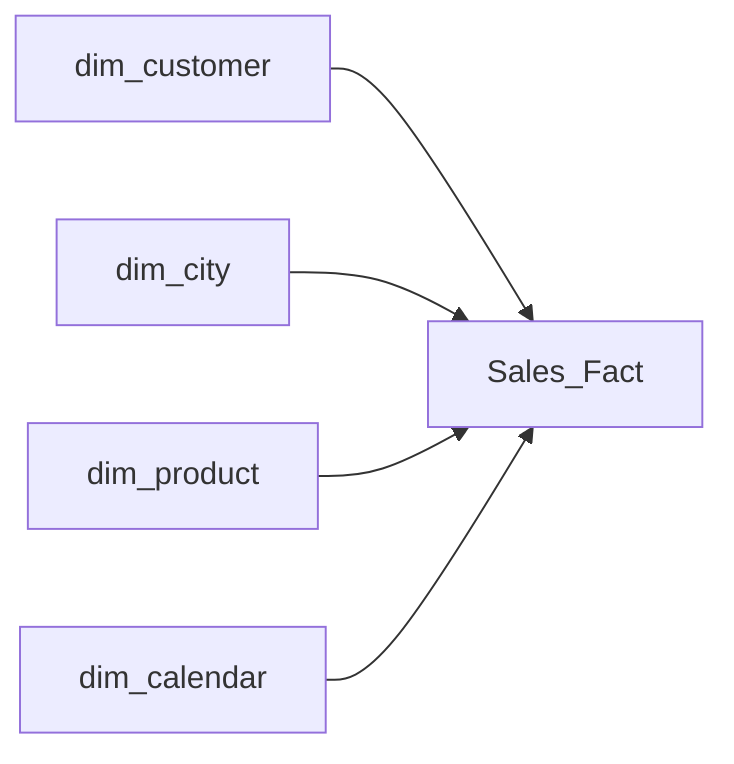
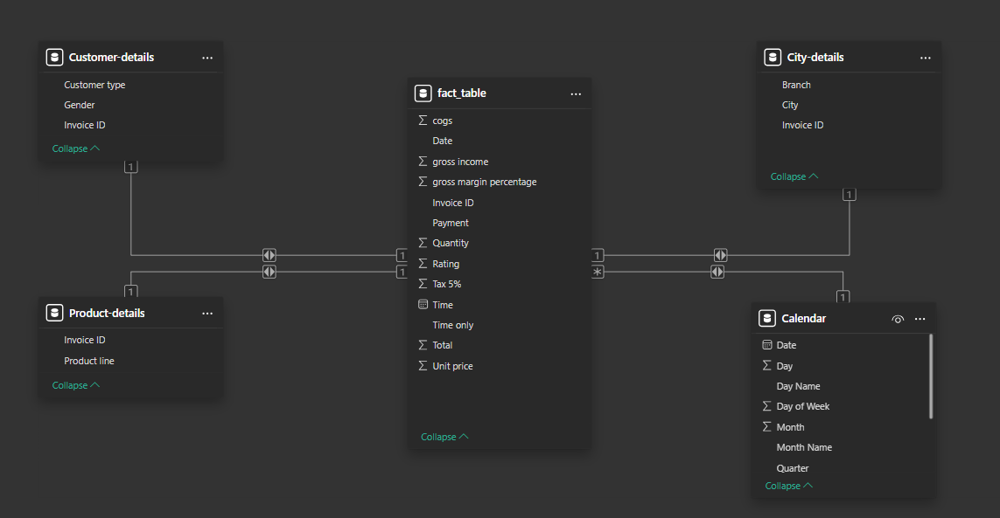
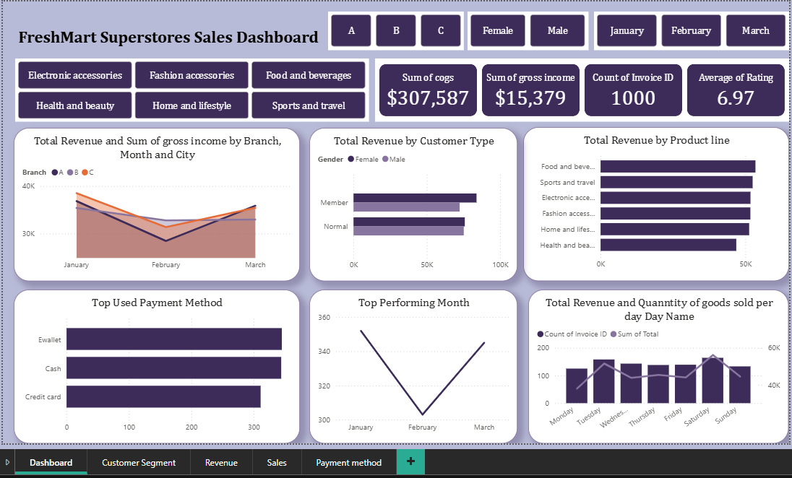
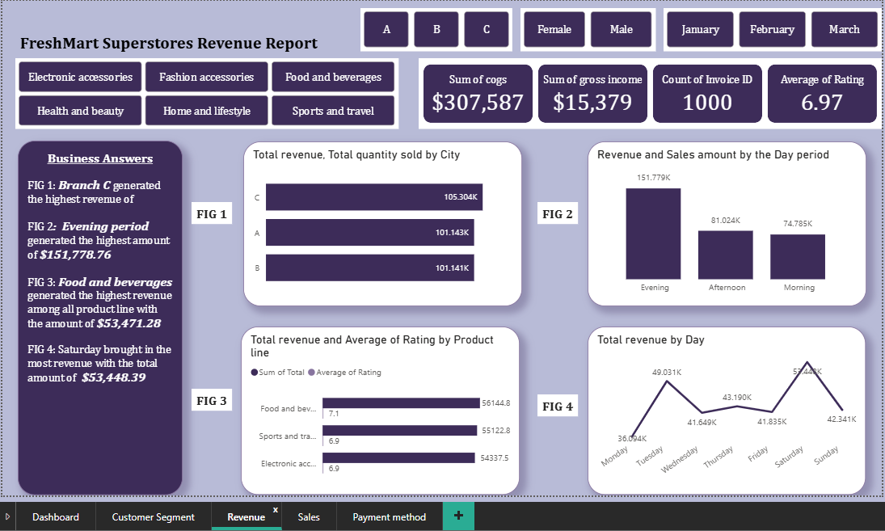
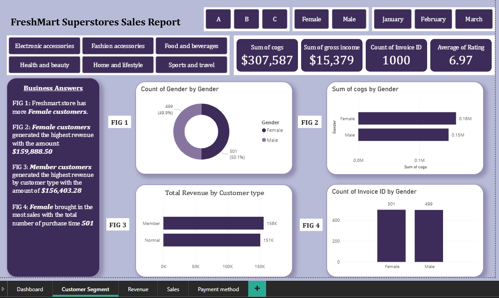
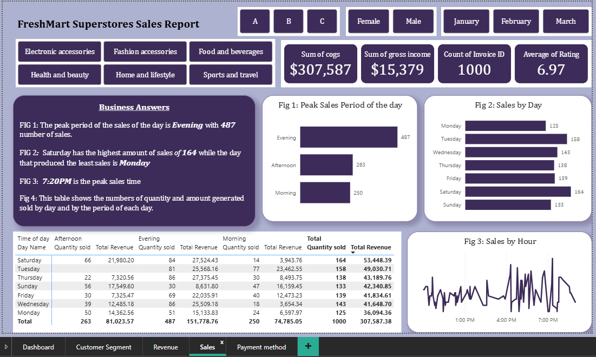
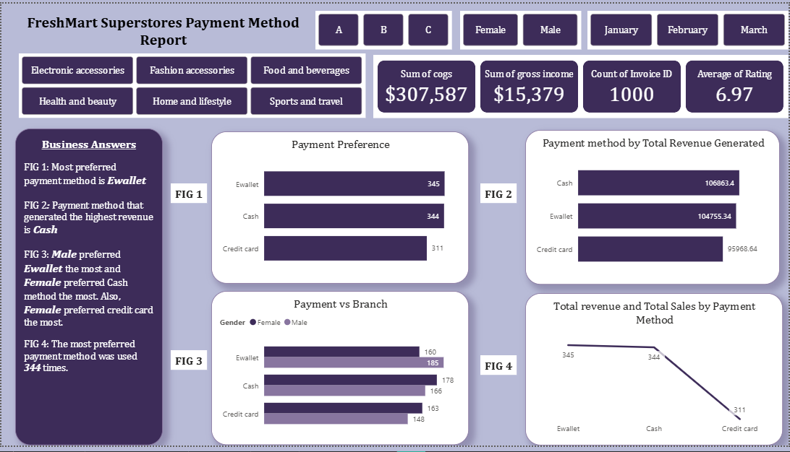

# 🛒 Freshmart Superstores Sales Performance Analysis

*A Power BI Data Analytics Project (Jan–Mar 2019)*

---

### 🔧 Tools & Technologies

---

## 📌 Overview

This project analyzes **Freshmart Superstores'** performance across three major branches in **Mandalay, Naypyitaw, and Yangon** from **January to March 2019**.

The dashboard answers key business questions on:

* Revenue performance
* Customer behavior
* Product line profitability
* Payment methods
* Daily & hourly sales patterns
* Time-of-day performance

---

## 📁 Table of Contents

* [Project Objectives](#project-objectives)
* [Business Questions](#business-questions)
* [Dataset Description](#dataset-description)
* [Tools Used](#tools-used)
* [Data Cleaning & Transformation](#data-cleaning--transformation)
* [Data Model](#data-model)
* [Dashboard Visuals](#dashboard-visuals)
* [Key Insights](#key-insights)
* [Recommendations](#recommendations)
* [Conclusion](#conclusion)
* [Contact](#contact)

---

## 🎯 Project Objectives

* Understand revenue and profit drivers across branches
* Identify customer spending patterns
* Analyze product performance
* Discover peak sales hours and high-demand days
* Support data-driven decision making for store operations

---

## 💼 Business Questions

1. Which branch generated the **highest revenue and profit**?
2. Do **Member** customers spend more than **Normal** customers?
3. Which **product line** performs best?
4. What **payment methods** do customers prefer?
5. What are the **daily, monthly, and hourly** sales trends?
6. Which **time of day** generates the highest revenue?

---

## 🧾 Dataset Description

Key fields include:

* Invoice ID
* Branch / City
* Customer Type (Member / Normal)
* Gender
* Product Line
* Unit Price, Quantity, Total
* COGS, Gross Income
* Payment Method
* Rating
* Date & Time

---

## 🧰 Tools Used

* **Power BI** (Visualizations & Dashboard)
* **Power Query** (Data Cleaning)
* **DAX** (Measures & KPIs)

---

## 🛠 Data Cleaning & Transformation

Performed in **Power Query**:

* Verified and corrected data types
* Promoted headers
* Removed duplicates
* Built **dimension tables**:

  * `dim_customer`, `dim_product`, `dim_city`, `dim_calendar`
* Created **Time-of-Day** column (Morning, Afternoon, Evening)
* Built full **Date hierarchy** (Year → Quarter → Month → Day → Hour)
* Created DAX measures:

  * Total Revenue
  * Total Orders
  * Total Gross Income
  * Average Rating

---

## 🗂 Data Model

> 📌 Note: Mermaid diagram is GitHub-renderable.

---

## 📸 Dashboard Visuals

### 🖥️ Overview Dashboard

### 💰 Revenue View

### 👥 Customer Segmentation

### 📈 Sales Trends

### 🛍️ Product Performance

---

## 📈 Key Insights

* **Mandalay (Branch C)** leads in revenue & profit
* **Member customers** spend more than Normal customers
* **Female shoppers** buy slightly more than males
* **Food & Beverages** is the best-performing product line
* **E-wallet** and Cash are the most used payment options
* **Evening (4–9 PM)** is the highest sales period
* **January** and **Saturdays** record peak sales

---

## 💡 Recommendations

* Expand Mandalay’s effective sales strategies to other branches
* Add more staff & promos during **evening peak hours**
* Strengthen loyalty program with **tiered rewards**
* Increase stock for **Food & Beverages**
* Partner with E-wallet providers for promo deals
* Run weekend campaigns & extend store hours

---

## 🧾 Conclusion

This analysis reveals customer behavior, high-performing segments, and revenue drivers across Freshmart branches.
Implementing the recommendations will help Freshmart improve efficiency, customer experience, and sales growth.

---

## 📬 Contact

**Author:** *Rafat Adebanjo*

* 🔗 LinkedIn: [https://www.linkedin.com/in/rafatadebanjo](https://www.linkedin.com/in/rafatadebanjo)
* 📧 Email: [aderafat@gmail.com](mailto:aderafat@gmail.com)
* 💻 GitHub: [https://github.com/Rophah](https://github.com/Rophah)

---

